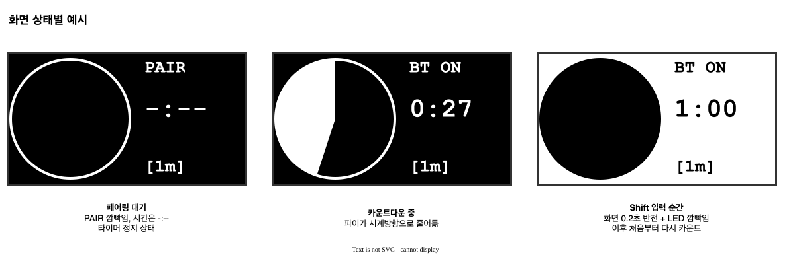
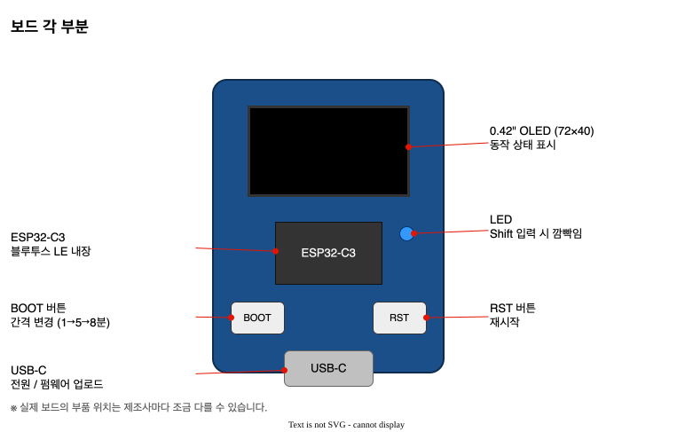
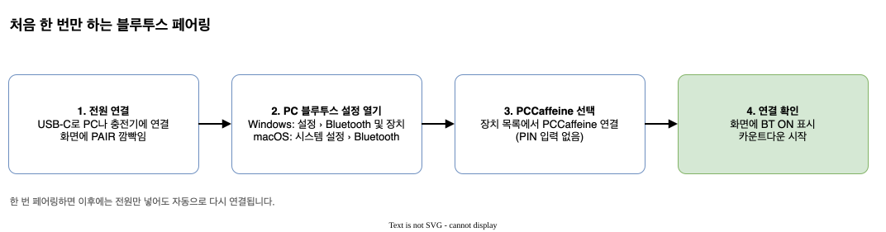
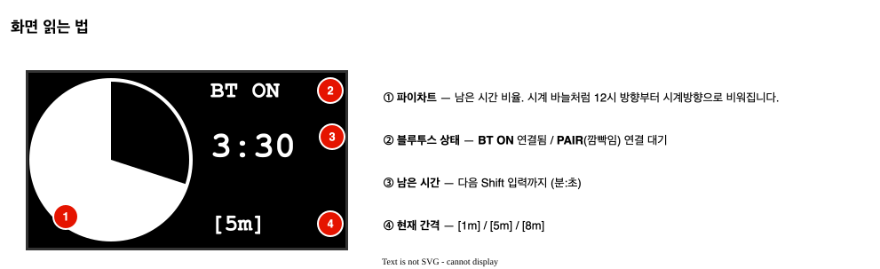
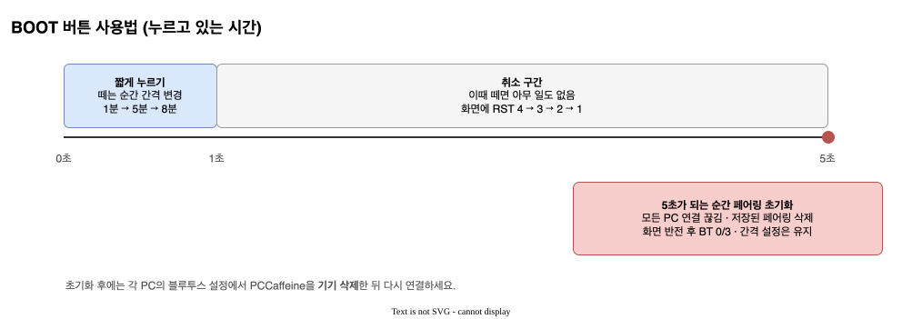
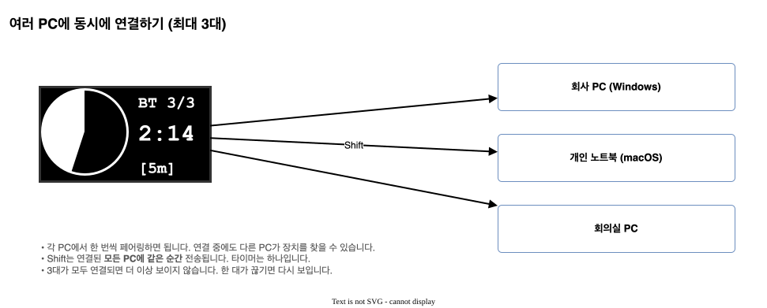
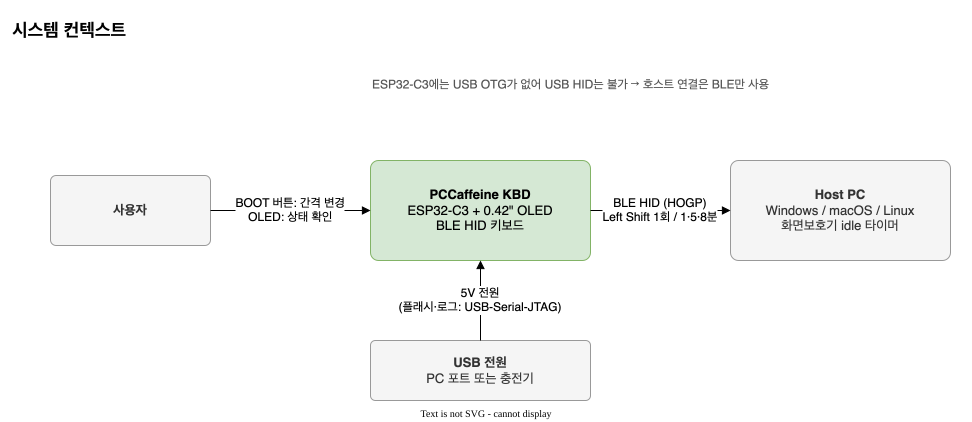
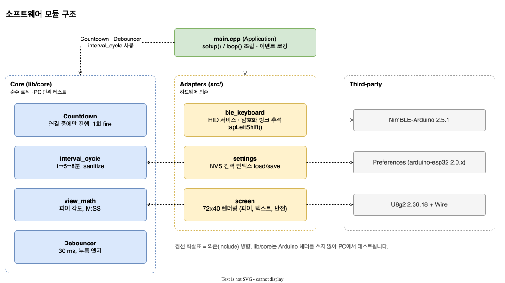
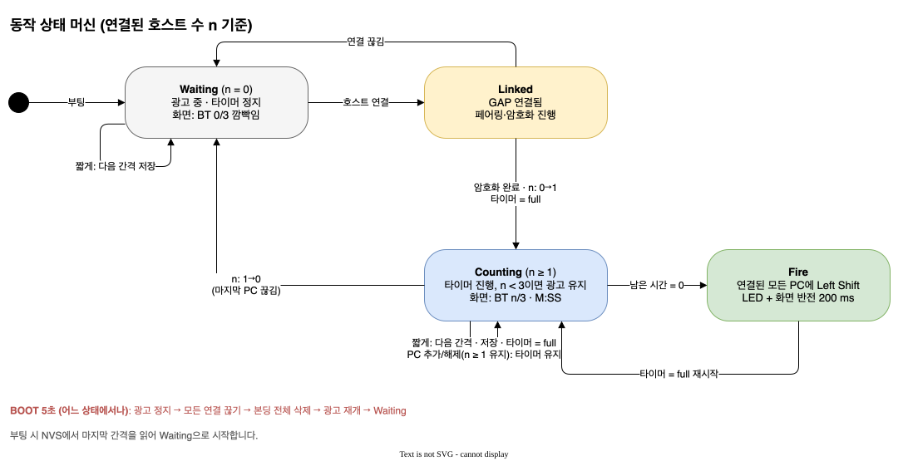

<div align="center">

# ☕ PCCaffeine KBD

**화면보호기와 자동 잠금을 막아 주는 손톱만 한 블루투스 키보드**

정해진 간격마다 `Left Shift`를 딱 한 번 눌러, 연결된 PC(최대 3대)가 잠들지 않게 합니다.




</div>

---

## ✨ 특징

- **키 하나만** — `Left Shift` 누름 → 50 ms → 뗌. 다른 키는 절대 보내지 않아 작업 중에도 글자가 입력되지 않습니다.
- **간격 1 / 5 / 8분** — BOOT 버튼을 짧게 누를 때마다 순환하며, 전원을 껐다 켜도 기억합니다.
- **파이차트 카운트다운** — 0.42" OLED에 남은 시간이 시계 바늘처럼 줄어듭니다.
- **최대 3대 동시 연결** — 회사 PC, 노트북, 회의실 PC에 같은 순간 Shift를 보냅니다.
- **버튼으로 페어링 초기화** — BOOT를 5초 누르면 저장된 페어링을 모두 지웁니다.
- **드라이버 설치 없음** — 표준 BLE HID(HOGP) 키보드라 Windows / macOS / Linux에서 바로 동작합니다.

## 🧩 하드웨어

ESP32-C3 + 0.42인치 OLED(72×40) 보드 하나면 됩니다.



| 기능 | 핀 | 비고 |
|------|----|------|
| OLED SSD1306 72×40 | SDA `GPIO5`, SCL `GPIO6` | I2C 400 kHz |
| BOOT 버튼 | `GPIO9` | active-low, 부팅 strap 핀 |
| LED | `GPIO8` | active-low |
| USB-C | USB-Serial-JTAG | 전원, 업로드, 로그 |

> **왜 USB가 아니라 블루투스인가요?** ESP32-C3에는 USB OTG가 없어서 USB 키보드가 될 수 없습니다. 그래서 USB는 전원으로만 쓰고 PC와는 BLE로 연결합니다.

## 🚀 빠른 시작

### 1. 빌드와 업로드

```sh
uv tool install platformio          # 또는 pipx install platformio
git clone https://github.com/elllight/pccaffeine_kbd.git && cd pccaffeine_kbd

pio run -e esp32c3 -t upload        # 빌드 + 업로드
pio device monitor -e esp32c3       # 시리얼 로그 (선택)
```

> **macOS 팁** — 업로드 후 칩이 업로드 대기 모드에 남는 경우가 있습니다(화면이 그대로이고 로그에 `waiting for download`). **USB 케이블을 뽑았다 다시 꽂으면** 정상 부팅합니다.
> 업로드 자체가 안 되면 BOOT를 누른 채 RST를 눌렀다 떼고, 그다음 BOOT를 떼서 다운로드 모드로 들어간 뒤 다시 시도하세요.

### 2. 페어링



PC의 블루투스 설정에서 **`PCCaffeine`**을 선택하면 끝입니다(PIN 없음). 다른 PC도 같은 방법으로 최대 3대까지 추가할 수 있습니다.

## 📟 사용법

### 화면 읽기



### 버튼



| 동작 | 결과 |
|------|------|
| 짧게 눌렀다 떼기 (1초 미만) | 간격 `1분 → 5분 → 8분 → 1분` 순환, 타이머 처음부터 |
| 1–5초 누르다 떼기 | 취소 (아무 일 없음) |
| 5초 누르고 있기 | 모든 페어링 삭제 후 연결 대기. 이후 각 PC에서 **기기 삭제** 후 다시 페어링 |

### 여러 PC에 연결



자세한 내용과 문제 해결은 **[사용 매뉴얼](docs/user-manual.md)** 을 참고하세요.

## 📚 문서

| 문서 | 내용 |
|------|------|
| [사용 매뉴얼](docs/user-manual.md) | 페어링, 화면, 버튼, 여러 PC, 초기화, 문제 해결 |
| [설계 사양서 (SADS)](docs/sads.md) | 하드웨어, 모듈 구조, 상태 머신, BLE 설계, 설계 결정, 검증 결과 |
| [제품 사양 (spec.md)](spec.md) | 동작 요구사항 정본 |
| [작업 계획 (Plans.md)](Plans.md) | 개발 태스크와 완료 근거 |

<details>
<summary><b>설계 다이어그램 미리보기</b></summary>

<br>





</details>

## 🛠 개발

```text
lib/core/        하드웨어와 무관한 로직 — PC에서 단위 테스트
  ├─ countdown        연결 중에만 진행하는 주기 타이머
  ├─ interval_cycle   1→5→8분 순환
  ├─ debouncer        버튼 디바운스 (30 ms)
  ├─ button_gesture   짧게 / 취소 / 5초 길게
  ├─ host_set         연결된 호스트 집합 (최대 3)
  └─ view_math        파이 각도, M:SS, BT n/3
src/             Arduino 펌웨어
  ├─ ble_keyboard     NimBLE HID, 다중 호스트, 페어링 초기화
  ├─ screen           U8g2 72×40 렌더링
  ├─ settings         NVS 간격 저장
  └─ main.cpp         조립과 이벤트 로깅
test/            Unity 테스트 (6 스위트, 42 케이스)
docs/            매뉴얼, 설계 사양서, draw.io 다이어그램(+SVG)
```

| 작업 | 명령 |
|------|------|
| 단위 테스트 | `pio test -e native` |
| 펌웨어 빌드 | `pio run -e esp32c3` |
| 정적 분석 | `pio check -e esp32c3 --skip-packages` |
| 포맷 검사 | `clang-format --dry-run --Werror src/* lib/core/src/* test/*/*.cpp` |
| 다이어그램 재생성 | `python3 tools/gen_diagrams.py && tools/export_diagrams.sh` |

주요 라이브러리: [NimBLE-Arduino](https://github.com/h2zero/NimBLE-Arduino) 2.5.1, [U8g2](https://github.com/olikraus/u8g2) 2.36.18

## ⚠️ 알려진 제약

- 전원을 넣는 순간 BOOT를 누르고 있으면 칩이 다운로드 모드로 부팅합니다(ESP32-C3 하드웨어 동작).
- 장치만 초기화하면 PC에 예전 페어링 정보가 남습니다. PC에서도 기기를 삭제해야 다시 연결됩니다.
- 2대 이상 동시 연결은 설계·단위 테스트까지 마쳤고, 실기 검증은 macOS 1대로만 했습니다.
- 일부 기업 보안 정책은 키보드 입력과 상관없이 화면을 잠급니다.
