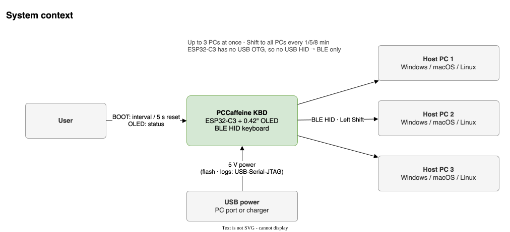
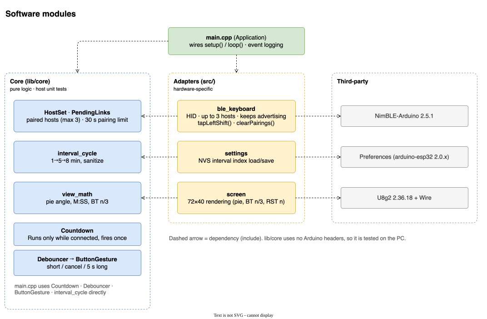
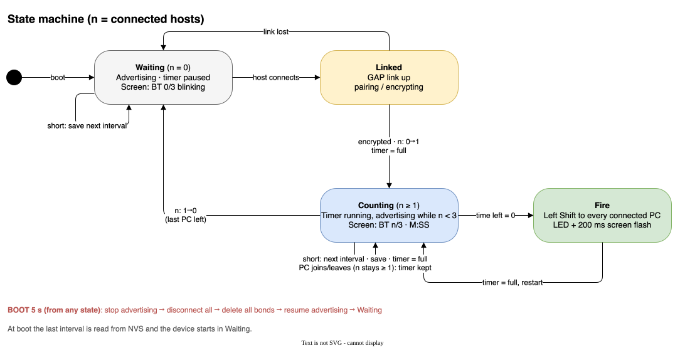

<div align="center">

**English** | [한국어](README.ko.md)

# ☕ PCCaffeine KBD

**A thumbnail-sized Bluetooth keyboard that keeps your PCs from locking or starting the screensaver**

It taps `Left Shift` exactly once at a fixed interval, so every connected PC (up to 3) stays awake.


</div>

---

## ✨ Features

- **One key only** — `Left Shift` down → 50 ms → up. No other key is ever sent, so nothing gets typed into your work.
- **1 / 5 / 8 minute interval** — a short press on BOOT cycles through them, and the choice survives power-off.
- **Pie-chart countdown** — the 0.42" OLED shows the time left shrinking like a clock hand.
- **Up to 3 PCs at once** — office PC, laptop and meeting-room PC all get the same Shift at the same moment.
- **Pairing reset on the device** — hold BOOT for 5 seconds to forget every stored pairing.
- **No drivers** — a standard BLE HID (HOGP) keyboard that works on Windows, macOS and Linux out of the box.

## 🧩 Hardware

All you need is an ESP32-C3 board with a 0.42-inch (72×40) OLED.


| Function | Pin | Notes |
|----------|-----|-------|
| OLED SSD1306 72×40 | SDA `GPIO5`, SCL `GPIO6` | I2C 400 kHz |
| BOOT button | `GPIO9` | active-low, boot strapping pin |
| LED | `GPIO8` | active-low |
| USB-C | USB-Serial-JTAG | power, upload, logs |

> **Why Bluetooth instead of USB?** The ESP32-C3 has no USB OTG, so it cannot act as a USB keyboard. USB is used for power only and the PCs connect over BLE.

## 🚀 Quick start

### 1. Build and upload

```sh
uv tool install platformio          # or: pipx install platformio
git clone https://github.com/elllight/pccaffeine_kbd.git && cd pccaffeine_kbd

pio run -e esp32c3 -t upload        # build + upload
pio device monitor -e esp32c3       # serial log (optional)
```

> **macOS tip** — after an upload the chip can stay in download mode (the screen does not change and the log says `waiting for download`). **Unplug and replug the USB cable** to boot normally.
> If the upload itself fails, hold BOOT, press and release RST, then release BOOT to enter download mode and try again.

### 2. Pair


Pick **`PCCaffeine`** in your PC's Bluetooth settings — that's it (no PIN). Add other PCs the same way, up to 3.

## 📟 Usage

### Reading the screen


### The button


| Action | Result |
|--------|--------|
| Short press and release (< 1 s) | Interval cycles `1 → 5 → 8 → 1 min`, timer restarts |
| Hold 1–5 s, then release | Cancelled (nothing happens) |
| Hold for 5 s | Every pairing is deleted and the device waits for a host. Then **remove** PCCaffeine on each PC and pair again |

### Several PCs


See the **[user manual](docs/user-manual.en.md)** for details and troubleshooting.

## 📚 Documentation

| Document | Contents |
|----------|----------|
| [User manual](docs/user-manual.en.md) ([한국어](docs/user-manual.md)) | Pairing, screen, button, several PCs, reset, troubleshooting |
| [Design spec (SADS, Korean)](docs/sads.md) | Hardware, modules, state machine, BLE design, design decisions, test results |
| [Product spec (spec.md)](spec.md) | Source of truth for the behaviour |
| [Task plan (Plans.md)](Plans.md) | Development tasks and their evidence |

<details>
<summary><b>Design diagrams</b></summary>

<br>





</details>

## 🛠 Development

```text
lib/core/        hardware-independent logic — unit-tested on the PC
  ├─ countdown        periodic timer that runs only while connected
  ├─ interval_cycle   1→5→8 min cycle
  ├─ debouncer        button debounce (30 ms)
  ├─ button_gesture   short / cancel / 5 s long
  ├─ host_set         connected hosts (max 3)
  ├─ pending_links    links still pairing (30 s limit)
  └─ view_math        pie angle, M:SS, BT n/3
src/             Arduino firmware
  ├─ ble_keyboard     NimBLE HID, multi-host, pairing reset
  ├─ screen           U8g2 72×40 rendering
  ├─ settings         NVS interval storage
  └─ main.cpp         wiring and event logging
test/            Unity tests (7 suites, 49 cases)
docs/            manual, design spec, draw.io diagrams (+SVG, KO/EN)
```

| Task | Command |
|------|---------|
| Unit tests | `pio test -e native` |
| Firmware build | `pio run -e esp32c3` |
| Static analysis | `pio check -e esp32c3 --skip-packages` |
| Format check | `clang-format --dry-run --Werror src/* lib/core/src/* test/*/*.cpp` |
| Regenerate diagrams | `python3 tools/gen_diagrams.py && tools/export_diagrams.sh` |

Diagram labels are translated through `tools/diagram_i18n_en.json`; the generator fails if a Korean label has no English entry.

Main libraries: [NimBLE-Arduino](https://github.com/h2zero/NimBLE-Arduino) 2.5.1, [U8g2](https://github.com/olikraus/u8g2) 2.36.18

## ⚠️ Known limitations

- Holding BOOT while powering on boots the chip into download mode (ESP32-C3 hardware behaviour).
- Resetting only the device leaves the old pairing on the PC. Remove the device on the PC as well before pairing again.
- Two or more simultaneous hosts are designed and unit-tested, but on-device testing was done with a single macOS host.
- Some corporate security policies lock the screen regardless of keyboard input.
