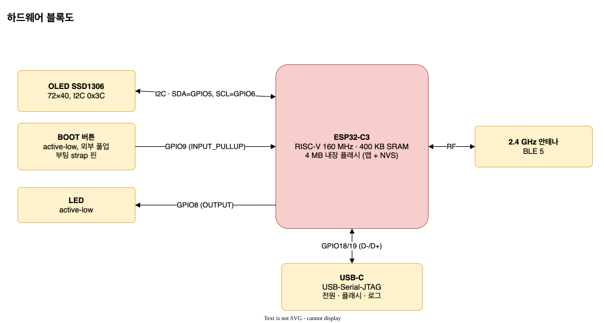
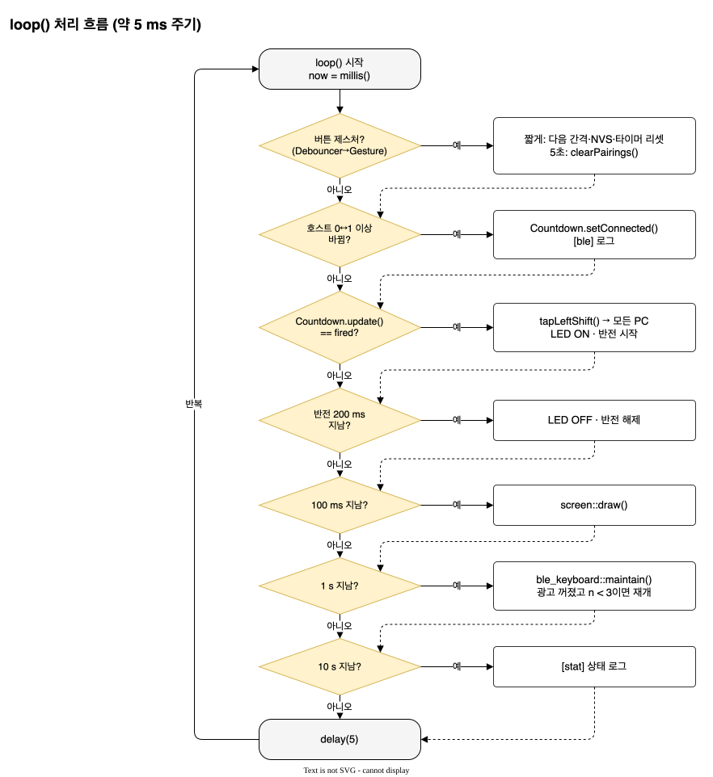
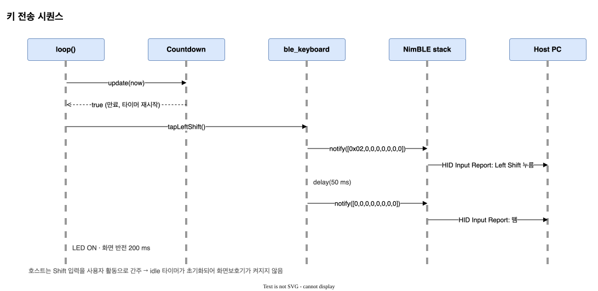

# PCCaffeine KBD — 소프트웨어 아키텍처 설계 사양서 (SADS)

| 항목 | 내용 |
|------|------|
| 문서 버전 | 1.1 (다중 호스트, 페어링 초기화 추가) |
| 작성일 | 2026-10-05 |
| 대상 펌웨어 | `pccaffeine_kbd` (PlatformIO, env `esp32c3`) |
| 상위 문서 | [spec.md](../spec.md) — 제품 요구사항 SSOT |
| 사용자 문서 | [user-manual.md](user-manual.md) |

---

## 1. 목적과 범위

이 문서는 PCCaffeine KBD 펌웨어의 하드웨어 구성, 소프트웨어 구조, 동적 동작, 인터페이스와 설계 결정을 정의합니다.
제품이 **무엇을** 해야 하는지는 `spec.md`가 정본이고, 이 문서는 그것을 **어떻게** 구현했는지를 설명합니다. 두 문서가 충돌하면 `spec.md`가 우선합니다.

### 1.1 제품 요약

ESP32-C3 + 0.42" OLED 보드를 BLE HID 키보드로 동작시켜, 설정한 간격(1/5/8분)마다 **Left Shift를 1회** 연결된 호스트 PC(최대 3대)에 보냅니다. 호스트는 이를 사용자 입력으로 인식하므로 idle 타이머가 초기화되어 화면보호기/자동 잠금에 진입하지 않습니다.

### 1.2 용어

| 용어 | 의미 |
|------|------|
| HOGP | HID over GATT Profile. BLE로 키보드/마우스를 연결하는 표준 프로파일 |
| NVS | ESP-IDF Non-Volatile Storage. 플래시에 key-value 저장 |
| Fire | 카운트다운 만료로 Shift를 보내는 이벤트 |
| 준비됨(ready) | 페어링이 끝나 **암호화된 링크**로 호스트가 연결된 상태 (spec §3) |

## 2. 시스템 컨텍스트

| 외부 요소 | 인터페이스 | 방향 |
|-----------|------------|------|
| Host PC ×최대 3 | BLE HID (HOGP), Input Report ID 1, 동시 연결 | 장치 → PC |
| 사용자 | BOOT 버튼(짧게 / 5초), OLED 표시 | 양방향 |
| USB 전원 | 5V 전원, USB-Serial-JTAG (업로드/로그) | PC/충전기 → 장치 |

**설계 제약 C-1**: ESP32-C3에는 USB OTG 컨트롤러가 없고, 내장 USB는 Serial/JTAG 전용입니다. 따라서 USB HID 키보드는 구현할 수 없으며 호스트 연결은 BLE만 사용합니다.

## 3. 하드웨어 아키텍처

| 기능 | 핀 / 버스 | 설정 | 비고 |
|------|-----------|------|------|
| OLED SSD1306 72×40 | I2C, SDA=GPIO5, SCL=GPIO6 | 400 kHz, 주소 0x3C | U8g2 `SSD1306_72X40_ER` |
| BOOT 버튼 | GPIO9 | `INPUT_PULLUP`, active-low | 부팅 strap 핀 (LOW로 부팅하면 다운로드 모드) |
| LED | GPIO8 | `OUTPUT`, active-low | strap 핀, 부팅 후 출력으로 사용 |
| USB | GPIO18/19 | USB-Serial-JTAG | `ARDUINO_USB_CDC_ON_BOOT=1` → `Serial` = HWCDC |
| 무선 | 내장 2.4 GHz | BLE 5 | NimBLE 호스트 스택 |

핀 정의는 `src/pins.h` 한 곳에만 둡니다.

## 4. 소프트웨어 아키텍처

### 4.1 계층 구조

| 계층 | 위치 | 원칙 |
|------|------|------|
| Application | `src/main.cpp` | 모듈을 조립하고 이벤트를 연결합니다. 자체 로직은 최소화합니다. |
| Adapters | `src/ble_keyboard.*`, `src/screen.*`, `src/settings.*` | 하드웨어·서드파티 라이브러리를 감쌉니다. 바깥으로는 작은 함수 인터페이스만 노출합니다. |
| Core | `lib/core/src/*` | Arduino 헤더를 쓰지 않는 순수 로직입니다. 시간은 `uint32_t now`로 주입받아 PC에서 단위 테스트합니다. |
| Third-party | `.pio/libdeps/` | NimBLE-Arduino 2.5.1, U8g2 2.36.18, arduino-esp32 2.0.x `Preferences` |

**의존 규칙**: Application → Adapters/Core → Third-party 방향만 허용합니다. Core는 어떤 계층에도 의존하지 않습니다.

### 4.2 모듈 명세

#### Core

| 모듈 | 공개 인터페이스 | 책임 |
|------|-----------------|------|
| `interval_cycle` | `sanitize(int32_t)`, `next(uint8_t)`, `minutesAt(uint8_t)`, `durationMs(uint8_t)` | 간격 테이블 `{1, 5, 8}`분과 순환. 잘못된 인덱스는 0(1분)으로 보정합니다. |
| `Countdown` | `setDuration(ms, now)`, `setConnected(bool, now)`, `update(now) → bool`, `remainingMs(now)`, `remainingFraction(now)` | 연결 중에만 진행하는 주기 타이머. 연결 상승 엣지와 간격 변경 시 full로 리셋하고, 만료 시 `true`를 1회 반환한 뒤 재시작합니다. |
| `Debouncer` | `update(rawPressed, now) → bool`, `pressed()` | 30 ms 동안 안정된 입력만 받아들입니다. 안정된 상태(`pressed()`)를 `ButtonGesture`에 넘깁니다. |
| `ButtonGesture` | `update(pressed, now) → Event{None, Short, Long}`, `holding(now)`, `secondsToLong(now)` | 짧게(1 s 미만에서 뗌) / 취소(1–5 s) / 길게(5 s 도달 시 1회, 누른 채 발생). `RST n` 표시용 남은 초 계산 |
| `HostSet` | `add(handle)`, `remove(handle)`, `contains`, `count()`, `full()` | 암호화된 호스트 연결 핸들 집합, 최대 3. 중복·무효 핸들 무시 |
| `view_math` | `consumedDegrees`, `clockAngleDeg`, `pieFilled`, `formatMSS`, `formatLinkLabel`, `formatIntervalLabel` | 파이 픽셀 판정과 시간 문자열 생성. 초는 올림 처리해서 만료 전에 `0:00`이 보이지 않게 합니다. |

#### Adapters

| 모듈 | 공개 인터페이스 | 책임 |
|------|-----------------|------|
| `ble_keyboard` | `begin(name)`, `connectedCount()`, `isConnected()`, `isAdvertising()`, `maintain()`, `bondCount()`, `clearPairings()`, `tapLeftShift(holdMs=50)` | HID 서비스 구성, 최대 3대 호스트 추적, 광고 유지·복구, 페어링 초기화, Left Shift 리포트 전송 |
| `screen` | `begin(sda, scl)`, `draw(const State&)` | 72×40 프레임 렌더링 (파이, `BT n/3` 또는 `RST n`, `M:SS`, `[Nm]`, 반전) |
| `settings` | `loadIntervalIndex()`, `saveIntervalIndex(idx)` | NVS 네임스페이스 `pccaffeine`, 키 `interval` (uint8) |

## 5. 동적 동작

### 5.1 상태 머신

| 상태 | 진입 조건 | 타이머 | 화면 |
|------|-----------|--------|------|
| Waiting | 부팅, 마지막 호스트 끊김 (n = 0) | 정지 (full 유지) | `BT 0/3` 깜빡임, `-:--`, 빈 원 |
| Linked | GAP 연결 수립 | 정지 | Waiting과 동일 (아직 준비 전) |
| Counting | 첫 호스트 암호화 완료 (n: 0→1) | 진행. 이후 호스트가 늘거나 줄어도 n ≥ 1이면 유지 | `BT n/3`, `M:SS`, 파이 |
| Fire | 남은 시간 = 0 | full로 재시작 | 200 ms 반전 + LED, 모든 호스트에 전송 |

Linked 상태를 따로 두는 이유는 §7(ADR-3)에 있습니다. BOOT 5초 누르기는 어느 상태에서든 페어링을 초기화하고 Waiting으로 돌아갑니다(§6.4).

### 5.2 메인 루프

- 루프 주기: 약 5 ms (`delay(5)`)
- 화면 갱신: 100 ms마다 (I2C 400 kHz에서 360바이트 전송 ≈ 10 ms)
- 광고 유지: 1 s마다 `ble_keyboard::maintain()` (§6.2)
- 상태 로그: 10 s마다 `[stat] hosts=<n>/3 adv=<0|1> bonds=<k> interval=<N>m remaining=<M:SS>`
- 시간은 모두 `millis()` 기반 `uint32_t`이며, 부호 없는 뺄셈으로 약 49.7일 주기의 wraparound를 처리합니다(테스트 `test_millis_wraparound`).

### 5.3 키 전송 시퀀스

`tapLeftShift()`는 루프 안에서 50 ms 동안 블록합니다. 이 시간 동안 버튼 입력은 디바운서가 다음 루프에서 처리하므로 누락되지 않습니다(30 ms 안정 조건).

## 6. 인터페이스 설계

### 6.1 BLE HID

| 항목 | 값 |
|------|----|
| 장치 이름 / Appearance | `PCCaffeine` / `0x03C1` (Keyboard) |
| 서비스 | HID (0x1812), Device Information (PnP), Battery (100 % 고정) |
| 보안 | Bonding ON, MITM OFF, Secure Connections ON, IO capability `NoInputNoOutput` (Just Works) |
| 동시 연결 | 최대 3 (`kMaxHosts`, `CONFIG_BT_NIMBLE_MAX_CONNECTIONS=3`), 본딩 저장 5 (`MAX_BONDS=5`), CCCD 16 |
| 광고 | 연결 수 < 3이면 연결 중에도 계속 광고. 끊기면 `advertiseOnDisconnect(true)`로 재개 |
| Input Report | Report ID 1, 8바이트: `[modifiers, reserved, key1..key6]` |
| 전송 값 | 누름 `[0x02,0,0,0,0,0,0,0]` (Left Shift) → 50 ms → 뗌 `[0,0,0,0,0,0,0,0]` |

리포트 디스크립터는 표준 부트 키보드 형식(modifier 8비트 + reserved + 6키 배열)에 Report ID를 붙인 것입니다(`src/ble_keyboard.cpp`의 `kReportMap`).
**안전 규칙**: 코드 전체에서 전송하는 modifier 값은 `0x02`와 `0x00` 두 가지뿐입니다(spec §4.1).

### 6.2 연결 준비 판정과 광고 유지

- 호스트는 **암호화된 링크**가 된 순간(`onAuthenticationComplete` + `isEncrypted()`)부터 연결된 것으로 셉니다. 핸들은 `HostSet`에 넣고, `onDisconnect`에서 뺍니다.
- `HostSet`은 NimBLE 호스트 태스크가 쓰고 Arduino `loop()`가 읽으므로 `std::mutex`로 보호하고, 연결 수는 `std::atomic<uint8_t>`로 따로 둡니다. `isConnected()`는 `connectedCount() > 0`입니다.
- `kMaxHosts`, `HostSet::kCapacity`, `CONFIG_BT_NIMBLE_MAX_CONNECTIONS`는 `static_assert`로 서로 묶여 있어 어긋나면 컴파일이 실패합니다.
- 연결이 생기면 광고가 멈추므로, `onConnect`에서 raw 연결 수가 3 미만이면 광고를 다시 켭니다.
- **광고 자가 복구**: 새 호스트와 본딩하면 NimBLE가 IRK를 컨트롤러 resolving list에 넣으면서 `ble_gap_preempt()`로 광고를 멈추고 다시 켜지 않습니다(`ble_store.c` → `ble_hs_pvcy.c`). 그래서 `loop()`가 1 s마다 `maintain()`을 불러, 자리가 남았는데 광고가 꺼져 있으면 다시 켭니다(`[ble] advertising resumed`).
- 전송은 구독(CCCD) 여부를 확인하는 `notify()`(핸들 미지정)를 사용하므로, 구독한 **모든** 호스트에 한 번에 나갑니다. 실패하면 `[ble] notify failed`를 남깁니다.

### 6.3 영속 데이터 (NVS)

| 네임스페이스 | 키 | 타입 | 값 | 기본값 |
|--------------|----|------|----|--------|
| `pccaffeine` | `interval` | uint8 | 0=1분, 1=5분, 2=8분 | 0 |

- 읽을 때 `interval::sanitize()`로 보정합니다(네임스페이스 없음, 범위 밖 값 → 1분).
- 쓰기는 버튼을 누를 때만 일어나므로 플래시 마모는 무시할 수준입니다.

### 6.4 페어링 초기화 (BOOT 5초)

`ble_keyboard::clearPairings()` 순서:

1. `advertiseOnDisconnect(false)`, `stopAdvertising()` — `ble_gap_unpair()`는 상대가 IRK를 배포한 경우(Apple 호스트는 항상 배포) **광고 중이면 `BLE_HS_EBUSY`로 거부**합니다(`ble_gap.c` `ble_gap_unpair`).
2. 연결된 모든 호스트 `disconnect()`.
3. `deleteAllBonds()` — 실패 시 20 ms 간격으로 최대 5회 재시도합니다.
4. `advertiseOnDisconnect(true)`, `startAdvertising()`.
5. 성공하면 삭제한 본딩 수를, 실패하면 -1을 돌려줍니다. 로그는 각각 `[btn] pairing reset, k bond(s) cleared` / `[btn] pairing reset FAILED`.

간격 설정(NVS `pccaffeine/interval`)은 지우지 않습니다. 호스트 쪽에도 예전 키가 남아 있으므로, 사용자는 각 호스트에서 기기를 삭제한 뒤 다시 페어링해야 합니다.

### 6.5 시리얼 로그

| 접두어 | 시점 | 예 |
|--------|------|----|
| `[boot]` | setup 종료 | `[boot] PCCaffeine KBD, interval=1m` |
| `[ble]` | 링크/페어링/해제, 호스트 수 변화, 광고 재개, 전송 실패 | `[ble] hosts=2/3`, `[ble] advertising resumed` |
| `[btn]` | 간격 변경, 페어링 초기화 | `[btn] interval=5m`, `[btn] pairing reset, 1 bond(s) cleared` |
| `[fire]` | Shift 전송 | `[fire] LeftShift at 61s (interval=1m)` |
| `[stat]` | 10 s 주기 | `[stat] hosts=1/3 adv=1 bonds=1 interval=1m remaining=0:42` |
| `[nvs]` | 저장 실패 | `[nvs] open failed, interval not saved` |

## 7. 설계 결정 (ADR)

| ID | 결정 | 이유 | 대안과 기각 사유 |
|----|------|------|------------------|
| ADR-1 | 호스트 연결은 BLE HID | ESP32-C3에 USB OTG가 없음 (C-1) | ESP32-S3로 보드 변경 → 보유 하드웨어를 쓸 수 없음 |
| ADR-2 | BLE 스택은 NimBLE-Arduino 2.x, HID는 직접 구성 | Bluedroid보다 플래시·RAM이 작고, 2.x API가 유지보수 중 | `ESP32-BLE-Keyboard` 라이브러리 → 유지보수 중단, NimBLE 2.x와 호환 문제 |
| ADR-3 | "연결됨" = 암호화된 링크 | 첫 페어링 때 GAP 연결 직후 타이머를 시작하면 호스트가 구독하기 전에 Shift가 사라질 수 있음 (리뷰 지적, 커밋 `79e2c8e`) | `getConnectedCount() > 0` → 위 문제로 기각 |
| ADR-4 | 순수 로직을 `lib/core`로 분리하고 PC에서 테스트 | 하드웨어 없이 타이머·디바운스·파이 계산을 검증 | 보드 위 테스트만 → 느리고 반복하기 어려움 |
| ADR-5 | 간격 변경·재연결 시 타이머를 full로 리셋 | 사용자가 바꾼 간격이 바로 반영되는 것이 직관적 (사용자 결정) | 경과 시간 유지 → 기각 |
| ADR-6 | 미연결 시 타이머 정지 | 보낼 수 없는 키를 세는 것은 의미 없음 (사용자 결정) | 계속 진행 후 전송만 생략 → 기각 |
| ADR-7 | 파이는 픽셀 단위로 직접 계산 | U8g2에는 채워진 부채꼴 API가 없음. 37×37 영역 atan2 ≈ 1,400회/프레임은 C3에 충분히 가벼움 | 미리 계산한 비트맵 → 메모리와 복잡도 증가 |
| ADR-8 | 최대 3대 동시 연결, 타이머는 하나 | 여러 PC를 한 장치로 깨워 두기 (사용자 결정). 칩 한도는 연결+광고 6개, NimBLE 기본 3 | 한 번에 한 대만(Easy-Switch 방식) → 이 용도에는 불편 |
| ADR-9 | 짧게 누르기는 **뗄 때** 동작, 5초 누르기는 페어링 초기화 | 같은 버튼으로 두 기능을 구분하려면 누름 시점에 바로 실행할 수 없음 (사용자 결정) | 누름 즉시 간격 변경 → 길게 누를 때도 간격이 바뀌어 기각 |
| ADR-10 | 광고 상태를 1 s마다 점검해 복구 | NimBLE가 IRK 등록 때 광고를 멈추는 동작은 라이브러리 내부라 이벤트로 잡기 어려움. 주기 점검이 단순하고 원인과 무관하게 복구됨 | 광고 완료 콜백에서 재시작 → 모든 원인을 다 다루는지 보장하기 어려움 |

## 8. 자원 사용 (빌드 기준)

| 항목 | 값 |
|------|----|
| Flash (앱) | 약 528 KB / 1,280 KB (40.2 %) |
| RAM (정적) | 약 25.4 KB / 320 KB (7.8 %) |
| 파티션 | 기본 (`default.csv`, app 1.25 MB ×2 + NVS) |

## 9. 검증 전략

| 수준 | 방법 | 명령 / 근거 |
|------|------|-------------|
| 단위 테스트 | Unity, 호스트(native) 실행, 6개 스위트 42개 케이스 | `pio test -e native` |
| 빌드 | 프로젝트 소스 경고 0 (`-Wall -Wextra`) | `pio run -e esp32c3` |
| 정적 분석 | cppcheck, 프로젝트 소스 HIGH/MEDIUM 0 | `pio check -e esp32c3 --skip-packages` |
| 포맷 | `.clang-format` (Google 기반, 100열) | `clang-format --dry-run --Werror` |
| 코드 리뷰 | 독립 리뷰어, NimBLE 소스와 대조 검증 | v1.0 APPROVE (`3bf1da4`), v1.1 §9.2 |
| 실기 검증 | 플래시, 페어링, 1분 fire, 버튼 순환, 재부팅 후 유지 | Plans.md Phase 3, 아래 9.1 |

### 9.1 실기 검증 결과 (2026-10-05, macOS 호스트)

| 항목 | 결과 | 근거 |
|------|------|------|
| 칩 / 플래시 | ESP32-C3 (QFN32) rev v0.4, 내장 4 MB, 업로드 해시 검증 통과 | esptool 출력 |
| 부팅 / 화면 | `[boot] … interval=1m`, 페어링 대기 화면 정상 표시 | 시리얼 로그, 사용자 육안 확인 |
| 페어링 | GAP 연결 후 약 2.5 s 만에 암호화 완료 → `[ble] connected`. macOS에 Keyboard, VID `0xE502` / PID `0xA111`로 등록 | 시리얼 로그, `system_profiler SPBluetoothDataType` |
| Shift 전송 | `[fire]` 08:53:21.50 / 08:54:21.44 (간격 60.0 s). 같은 순간 macOS `HIDIdleTime`이 37.5 s → 0.8 s, 59.1 s → 0.1 s로 초기화 | 시리얼 로그, `ioreg -c IOHIDSystem` 1 s 샘플링 |
| 버튼 순환 | 4회 누름 → `5m → 8m → 1m → 5m`, 누를 때마다 1단계, 즉시 full 리셋 (`remaining=8:00`) | 시리얼 로그 |
| 설정 유지·재연결 | 케이블 재연결 후 `interval=5m` 복원, 재페어링 없이 `link=paired` | 시리얼 로그, 사용자 육안 확인 |

### 9.2 다중 호스트·페어링 초기화 실기 검증 (2026-10-05, macOS 호스트 1대)

| 항목 | 결과 | 근거 |
|------|------|------|
| 화면 `BT n/3` | Mac 연결 시 `BT 1/3`, 대기 시 `BT 0/3` 깜빡임 | 사용자 육안 확인 |
| 연결 중 광고 유지 | Mac 연결 상태에서 Mac BLE 스캔으로 `PCCaffeine`(HID 0x1812, RSSI −51 dBm) 확인, `adv=1` | `bleak` 스캔, 시리얼 로그 |
| 장시간 동작 | 30분 동안 Shift 58회, 간격 평균 ≈ 60 s, `hosts=1/3` 유지 | 시리얼 로그 |
| 짧게 누르기 | 뗄 때 `[btn] interval=5m` | 시리얼 로그 |
| 페어링 초기화 | 5초 → `1 bond(s) cleared`, `bonds=1→0`. Mac은 예전 키로 재접속 시도하다 암호화 실패로 끊김(`0x213`). Mac에서 기기 삭제 후 재페어링 성공 | 시리얼 로그, 사용자 확인 |
| 신규 본딩 후 광고 | 재페어링 1 s 뒤 `[ble] advertising resumed`, 이후 `adv=1` | 시리얼 로그 |
| 2대 이상 동시 연결 | **미검증** (호스트 1대만 보유) | — |

실기 중 발견해 고친 결함: 광고 중 `ble_gap_unpair()` EBUSY로 초기화가 실패하면서 성공으로 보고됨(`ca3791b`), 신규 본딩 후 광고 중단(`ad94eb6`).

### 요구사항 추적

| spec 항목 | 구현 | 테스트 |
|-----------|------|--------|
| §3 BLE HID, 이름, 본딩, 재광고 | `ble_keyboard` | 실기 3.2 |
| §3 다중 호스트 (최대 3대, 광고 유지) | `HostSet`, `ble_keyboard` | `test_hostset`, 실기 6.4 (1대) |
| §4.1 Left Shift만 전송 | `ble_keyboard::tapLeftShift` | 코드 리뷰, 실기 3.2 |
| §4.2 1→5→8분 순환, 리셋, NVS | `interval_cycle`, `settings`, `main.cpp` | `test_interval`, `test_countdown`, 실기 3.3 |
| §4.3 연결 중에만 진행, 재연결 리셋 | `Countdown`, `main.cpp` | `test_countdown` |
| §4.4 파이, 텍스트, 반전 | `view_math`, `screen` | `test_view`, 실기 3.1 |
| §4.5 디바운스, 짧게/취소/5초 초기화 | `Debouncer`, `ButtonGesture`, `ble_keyboard::clearPairings` | `test_debouncer`, `test_gesture`, 실기 7.3 |

## 10. 제약과 알려진 위험

| ID | 내용 | 대응 |
|----|------|------|
| R-1 | 전원 인가 시 BOOT(GPIO9)를 누르고 있으면 다운로드 모드로 부팅 | 하드웨어 특성. 사용자 매뉴얼 문제 해결에 안내 |
| R-2 | macOS에서 시리얼 포트를 DTR=0으로 열거나 RTS 펄스로 리셋하면 칩이 다운로드 모드(`boot:0x4`)로 들어가 펌웨어가 실행되지 않음 (실기에서 재현) | 업로드 후에는 케이블을 다시 꽂아 부팅. 로그는 DTR=1, RTS=0으로 열면 리셋 없이 읽힘 |
| R-3 | ~~여러 호스트 연결 시 하나만 추적~~ | v1.1에서 `HostSet`으로 해소 |
| R-4 | 일부 기업 보안 정책은 입력과 무관하게 화면을 잠금 | 제품 범위 밖 (매뉴얼에 안내) |
| R-5 | 2대 이상 동시 연결은 실기 미검증 | 호스트를 더 확보하면 Plans.md 6.4 재검증 |
| R-6 | 장치만 초기화하면 호스트에 예전 키가 남아 재연결 실패 | BLE 구조상 불가피. 매뉴얼에 "기기 삭제" 절차 안내 |

## 11. 빌드와 도구

| 항목 | 내용 |
|------|------|
| 플랫폼 | PlatformIO Core 6.2, `espressif32 @ ^6.9.0` (arduino-esp32 2.0.x) |
| 보드 정의 | `esp32-c3-devkitm-1`, `ARDUINO_USB_MODE=1`, `ARDUINO_USB_CDC_ON_BOOT=1` |
| 라이브러리 | `h2zero/NimBLE-Arduino @ ^2.5.1`, `olikraus/U8g2 @ ^2.36.18` |
| NimBLE 설정 | `CONFIG_BT_NIMBLE_MAX_CONNECTIONS=3`, `MAX_BONDS=5`, `MAX_CCCDS=16` |
| 테스트 환경 | `env:native` + Unity, `-std=gnu++17 -Wall -Wextra -Werror` |

## 12. 다이어그램 관리

- 원본: `docs/diagrams/*.drawio` (draw.io에서 직접 편집 가능)
- 생성 스크립트: `tools/gen_diagrams.py`가 원본을 생성합니다. 스크립트를 고치거나 `.drawio`를 직접 편집하세요. 직접 편집했다면 스크립트를 다시 실행하지 마세요(덮어씀).
- SVG 내보내기: `tools/export_diagrams.sh` (draw.io 데스크톱 CLI 필요, macOS: `brew install --cask drawio`)
