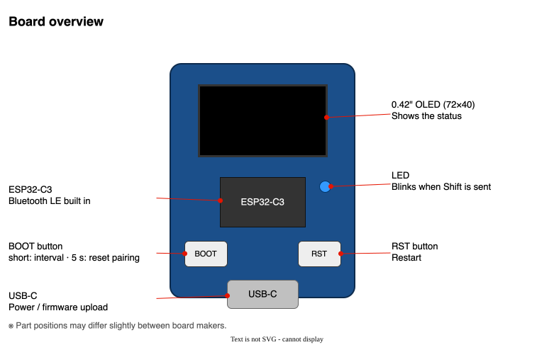
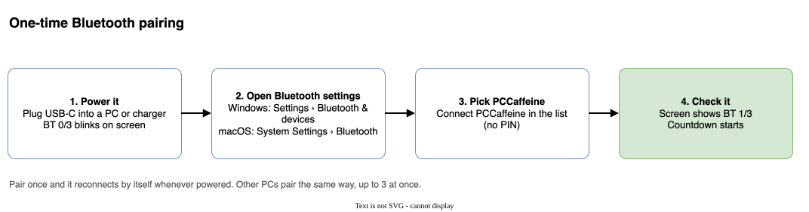
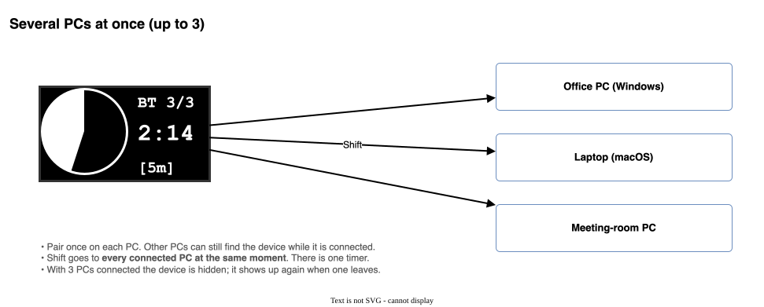
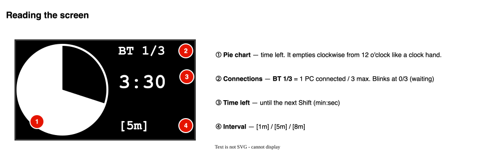
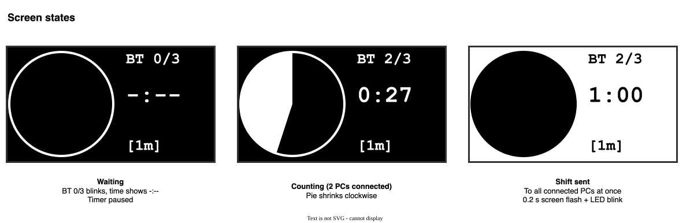
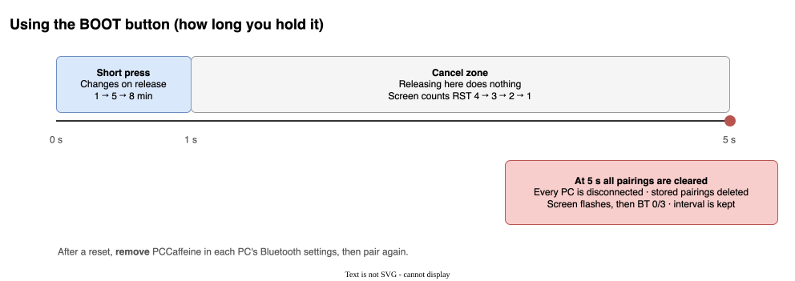
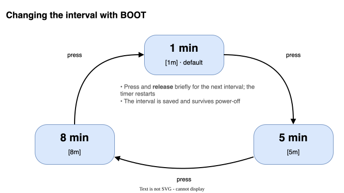

**English** | [한국어](user-manual.md)

# PCCaffeine User Manual

A **tiny Bluetooth keyboard that presses Shift once at a fixed interval** so your PC never starts the screensaver or locks itself.
It has no keys — just a screen and one button. All you choose is the interval.

---

## 1. At a glance

| Item | Details |
|------|---------|
| What it does | Presses **Left Shift** once every 1 / 5 / 8 minutes (never any other key) |
| PC link | **Bluetooth** (device name `PCCaffeine`), **up to 3 PCs at the same time** |
| Power | USB-C (PC USB port or phone charger) |
| Screen | 0.42-inch OLED, time left shown as a pie chart |
| Button | BOOT — short press: change interval / hold 5 s: reset pairing |

Shift on its own types nothing, so it never puts characters into the document you are working on.

## 2. Board overview



- **USB-C**: power input. USB is only for power; the PC talks to the device over Bluetooth.
- **BOOT button**: short press changes the interval, holding it for 5 seconds resets pairing.
- **RST button**: restarts the device.
- **LED**: blinks briefly when Shift is sent.

## 3. First use — Bluetooth pairing



1. Connect power with a USB-C cable. **BT 0/3** blinks at the top right and the time shows `-:--`.
2. Open Bluetooth settings on the PC.
   - Windows 11: **Settings › Bluetooth & devices › Add device › Bluetooth**
   - macOS: **System Settings › Bluetooth**
3. Select **PCCaffeine** in the list. There is no PIN.
4. When the screen changes to **BT 1/3** and the countdown starts, you are done.

After pairing once, the device reconnects by itself whenever it is powered.

## 4. Several PCs at once



- Pair other PCs exactly as in section 3. The device stays visible in other PCs' Bluetooth lists while it is connected.
- Up to **3 PCs** can be connected at the same time. `BT 2/3` on the screen means "2 of 3 connected".
- Shift is sent to **every connected PC at the same moment**. There is a single timer.
- With all 3 connected the device no longer shows up in Bluetooth lists; it appears again when one disconnects.
- The device remembers pairings for up to 5 PCs (3 connected at once).

## 5. Reading the screen



| No. | Shows | Meaning |
|-----|-------|---------|
| ① | Pie chart | Time left. It empties clockwise from 12 o'clock like a clock hand; when it is empty, Shift is sent. |
| ② | `BT n/3` | Connected PCs / maximum. A blinking `BT 0/3` means no PC is connected yet. |
| ③ | `M:SS` | Time until the next Shift (minutes:seconds) |
| ④ | `[1m]` `[5m]` `[8m]` | Current interval |

While BOOT is held for more than 1 second, ② shows `RST 4` → `RST 1` (seconds until the pairing reset).

### Screen states



- **Waiting**: no PC is connected. The timer is paused and no key is sent.
- **Counting down**: normal operation.
- **Shift sent**: the screen inverts for 0.2 s and the LED blinks, then counting starts over.

## 6. Using the button



### 6.1 Changing the interval (short press)



- **Press BOOT briefly and release** to step through `1 min → 5 min → 8 min → 1 min …`. It changes on release.
- The timer restarts **from the beginning** with the new interval right away.
- The interval is saved and **kept across power-off**. The first-use default is 1 minute.

> Which interval should I pick? One **shorter** than your PC's screensaver / lock timeout.
> For a 5-minute lock use 1 minute; for 10 minutes, 5 or 8 minutes works.

### 6.2 Resetting pairing (hold 5 seconds)

Forgets every PC the device has paired with and returns to the initial state.

1. **Keep holding** BOOT. After 1 second the screen counts `RST 4 → 3 → 2 → 1`.
2. At 5 seconds the screen inverts, every PC disconnects and `BT 0/3` blinks. You can release the button.
3. On **each PC you used, remove PCCaffeine** in the Bluetooth settings ("Remove device" / "Forget This Device").
4. Pair again as in section 3.

- Releasing during the countdown (between 1 and 5 seconds) does nothing.
- The interval setting (1/5/8 min) is not erased.
- If you skip step 3, the PC keeps trying with its old keys, fails, and stays listed as "Not connected".

## 7. Rules in short

- Time runs while **at least one** PC is connected.
- When the last PC disconnects, the timer pauses and the screen returns to `BT 0/3` waiting. On reconnect it starts from the beginning.
- PCs joining or leaving do not restart the timer as long as at least one stays connected.
- Shift is sent once as "press → about 0.05 s → release".

## 8. Troubleshooting

| Symptom | What to check |
|---------|---------------|
| The screen keeps blinking **BT 0/3** | Make sure Bluetooth is on. If PCCaffeine is not in the list, press RST and search again. |
| PCCaffeine is listed but will not connect | If you reset the device, the PC still has the old pairing. **Remove** the device on the PC and pair again. |
| A new PC cannot see PCCaffeine | With 3 PCs already connected (`BT 3/3`) it is hidden; disconnect one. Some devices only show it after keeping the list open for 10–20 seconds. |
| Connected, but the screensaver still starts | Check that the interval is shorter than the PC's lock timeout. Some corporate policies lock the screen regardless of keyboard input. |
| After power-on the screen keeps showing old content | Holding BOOT during power-on enters upload mode. Release the button and press **RST** or replug the cable. |
| The button does not change the interval | Release within 1 second. A long press starts the reset countdown (`RST n`), and releasing during it cancels. |
| The screen is completely dark | Check the USB cable and the power source (charger/port). |

## 9. Uploading firmware (developers)

```sh
pio run -e esp32c3 -t upload    # build + upload
pio device monitor -e esp32c3   # serial log (115200)
```

On macOS the chip can stay in upload mode after flashing, so **unplug and replug the USB cable** to boot.

If you cannot use the button, you can erase only the pairing storage from a PC (this also resets the interval setting):

```sh
~/.platformio/packages/tool-esptoolpy/esptool.py --chip esp32c3 --port <port> erase_region 0x9000 0x5000
```

The serial log prints link/disconnect (`[ble]`), button (`[btn]`) and Shift (`[fire]`) events, plus a status line every 10 seconds (`[stat] hosts=n/3 adv= bonds= …`).
For the internal design see the [design spec (Korean)](sads.md).
