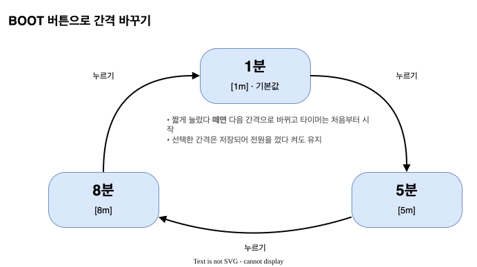

# PCCaffeine 사용 매뉴얼

PC 화면보호기나 자동 잠금이 켜지지 않도록 **정해진 시간마다 Shift 키를 한 번 눌러 주는 작은 블루투스 키보드**입니다.
키보드 자판은 없고, 화면과 버튼 하나로 동작합니다. 사용자는 간격만 고르면 됩니다.

---

## 1. 한눈에 보기

| 항목 | 내용 |
|------|------|
| 하는 일 | 1분 / 5분 / 8분마다 **Left Shift**를 1회 누름 (다른 키는 절대 보내지 않음) |
| PC 연결 | **블루투스** (장치 이름 `PCCaffeine`) |
| 전원 | USB-C (PC USB 포트나 휴대폰 충전기) |
| 화면 | 0.42인치 OLED, 남은 시간을 파이차트로 표시 |
| 버튼 | BOOT 버튼 — 간격 변경 |

Shift 키는 혼자 눌렸을 때 문자를 입력하지 않으므로, 문서 작업 중에도 글자가 들어가지 않습니다.

## 2. 보드 각 부분


- **USB-C**: 전원을 넣는 곳입니다. USB는 전원용이고, PC와는 블루투스로 통신합니다.
- **BOOT 버튼**: 짧게 누르면 간격이 바뀝니다.
- **RST 버튼**: 장치를 다시 시작합니다.
- **LED**: Shift를 보낼 때 잠깐 켜집니다.

## 3. 처음 사용하기 — 블루투스 페어링


1. USB-C 케이블로 전원을 연결합니다. 화면 오른쪽 위에 **PAIR**가 깜빡이고 시간은 `-:--`로 보입니다.
2. PC의 블루투스 설정을 엽니다.
   - Windows 11: **설정 › Bluetooth 및 장치 › 장치 추가 › Bluetooth**
   - macOS: **시스템 설정 › Bluetooth**
3. 목록에서 **PCCaffeine**을 선택해 연결합니다. PIN 입력은 없습니다.
4. 화면이 **BT ON**으로 바뀌고 카운트다운이 시작되면 끝입니다.

한 번 페어링하면 다음부터는 전원만 넣어도 자동으로 다시 연결됩니다.

## 4. 화면 읽는 법


| 번호 | 표시 | 의미 |
|------|------|------|
| ① | 파이차트 | 남은 시간 비율. 시계 바늘처럼 12시 방향부터 시계방향으로 비워집니다. 다 비면 Shift를 보냅니다. |
| ② | `BT ON` / `PAIR` | 블루투스 연결 상태. `PAIR`가 깜빡이면 PC와 연결되지 않은 상태입니다. |
| ③ | `M:SS` | 다음 Shift까지 남은 시간 (분:초) |
| ④ | `[1m]` `[5m]` `[8m]` | 현재 설정된 간격 |

### 상태별 화면


- **페어링 대기**: PC와 연결되지 않았습니다. 이때는 타이머가 멈춰 있고 키를 보내지 않습니다.
- **카운트다운 중**: 정상 동작 상태입니다.
- **Shift 입력 순간**: 화면이 0.2초 동안 반전되고 LED가 깜빡입니다. 그다음 처음부터 다시 셉니다.

## 5. 간격 바꾸기



- **BOOT 버튼을 짧게 한 번** 누를 때마다 간격이 `1분 → 5분 → 8분 → 1분 …` 순서로 바뀝니다.
- 바꾸는 즉시 타이머가 새 간격으로 **처음부터** 다시 시작합니다.
- 선택한 간격은 저장되어 **전원을 껐다 켜도 유지**됩니다. 처음 사용할 때 기본값은 1분입니다.

> 어떤 간격을 고를까요? PC의 화면보호기·잠금 시간보다 **짧은** 간격을 고르세요.
> 예를 들어 잠금 시간이 5분이면 1분, 10분이면 5분이나 8분을 쓰면 됩니다.

## 6. 동작 규칙 정리

- 블루투스가 연결되어 있을 때만 시간이 흐릅니다.
- 연결이 끊기면 타이머가 멈추고 **PAIR** 화면으로 돌아갑니다. 다시 연결되면 처음부터 셉니다.
- Shift는 "누름 → 약 0.05초 → 뗌"으로 한 번만 보냅니다.

## 7. 문제 해결

| 증상 | 확인할 것 |
|------|-----------|
| 화면이 계속 **PAIR**만 깜빡임 | PC 블루투스가 켜져 있는지 확인하세요. 목록에 PCCaffeine이 없으면 RST를 누른 뒤 다시 검색하세요. 예전에 등록했던 PCCaffeine이 있다면 PC에서 **장치 제거** 후 다시 페어링하세요. |
| 연결은 됐는데 화면보호기가 켜짐 | 간격이 PC 잠금 시간보다 짧은지 확인하세요. 회사 보안 정책으로 키보드 입력과 상관없이 잠기는 PC도 있습니다. |
| 전원을 넣었는데 화면이 안 바뀌고 예전 내용이 남아 있음 | 전원을 넣을 때 BOOT 버튼을 누르고 있으면 업로드 대기 모드로 들어갑니다. 버튼에서 손을 떼고 **RST**를 누르거나 케이블을 다시 꽂으세요. |
| 버튼을 눌러도 간격이 안 바뀜 | BOOT 버튼을 짧고 확실하게 누르세요. 한 번 누를 때 한 단계씩만 바뀝니다. |
| 화면이 아예 꺼져 있음 | USB 케이블과 전원(충전기/포트)을 확인하세요. |

## 8. 펌웨어 업로드 (개발자용)

```sh
pio run -e esp32c3 -t upload    # 빌드 + 업로드
pio device monitor -e esp32c3   # 시리얼 로그 (115200)
```

시리얼 로그에는 연결/해제(`[ble]`), 버튼(`[btn]`), Shift 전송(`[fire]`) 이벤트와 10초마다 상태(`[stat]`)가 출력됩니다.
내부 구조는 [설계사양서](sads.md)를 참고하세요.
